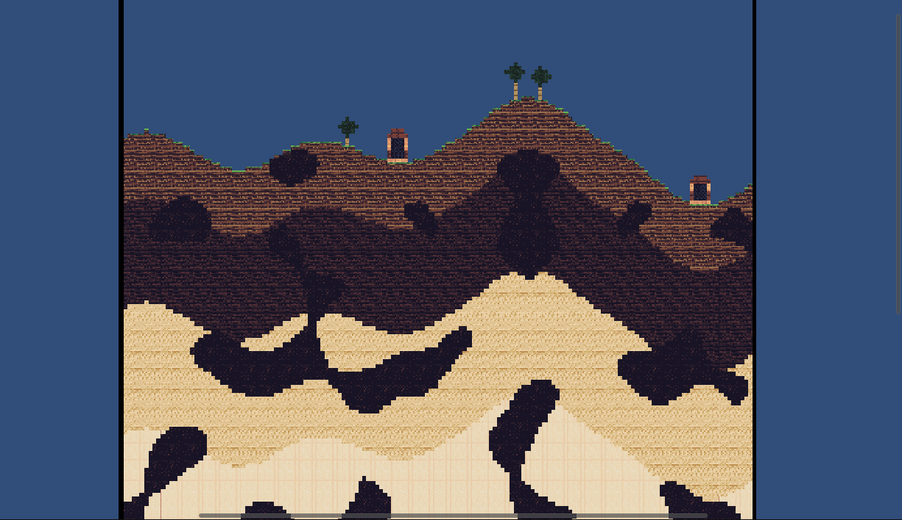

# Boom Survival

## Overview

**Boom Survival** The inspiration for this game came from my dear childhood game Little Big Planet. In Little Big Planet, players could create and share custom maps within the community. One particularly popular map genre was "bomb survival," where bombs would rain down from the sky, and players had to navigate the constantly evolving landscape while skilfully avoiding the falling bombs. I wanted to recreate this type of gameplay, while experimenting with procedurally generated terrain. This game was created by me using the Unity game-engine. **NOTE: The character was not created by me, it was a public
unity asset done by https://github.com/Matthew-J-Spencer/Ultimate-2D-Controller**

## Demo videos
# World demo (YouTube video link)
[](https://www.youtube.com/watch?v=sgNlUauDGJA)

# Gameplay demo (YouTube video link)
[](https://www.youtube.com/watch?v=Mctolj3tVOc)

## How to Run the Demo

### Requirements:
- Windows/MacOS/Linux

### Steps to Run:
1. **Download** the `demo_build.zip` file from the repository.  
2. **Extract** the contents to a folder of your choice.  
3. **Run** the executable:  
   - On **Windows**, double-click `BoomSurvival.exe`.  
   - On **Linux/macOS**, give execution permission if needed (`chmod +x BoomSurvival`), then run `./BoomSurvival`.

## World Generation

The world generation logic has undergone significant evolution, progressing through multiple iterations. Each version introduced new features and improvements, building upon the previous iteration. The system leverages procedural generation techniques, including Perlin noise and layered materials, to create a world that feels organic and unique with every playthrough. Below is a detailed breakdown of the key versions and their contributions to the final terrain generation system used:

### Version 1 – Basic Grid
- **Description:**  
  A 100x100 grid of equally sized blocks forms the basic terrain. While functional, this version lacked any variation in terrain.
- **Code Example:**
  ```csharp
  for (int x = 0; x < gridSize; x++) 
  {
      for (int y = 0; y < gridSize; y++) 
      {
          generateBlock(grassSprite, x, y, MaterialType.grass);
      }
  }

- **Image:**


### Version 2 – Cosine Wave Hills
- **Description:**  
  Terrain variation is introduced using a cosine wave to create simple hills. However, the hills are uniformly spaced and mirrored, resulting in a predictable pattern.

- **Code Example:**
  ```csharp
  float height = Mathf.Cos(x * waveFrequency) * heightMultiplier + heightLevel;

- **Image:**


### Version 3 – Perlin Noise Terrain
- **Description:**  
  This version replaces the cosine wave with Perlin noise to create more natural, organic terrain with smooth hills and valleys. The **seed** (random value between -10000 and 10000) ensures unique terrain generation. **terrainFreq** controls the spacing of hills and valleys — higher values create smaller, frequent variations, while lower values produce larger, spread-out features. **heightMultiplier** determines the height of the terrain features, with higher values resulting in taller hills. **heightLevel** sets a base height, ensuring the terrain doesn't drop too low and maintaining overall elevation balance.

- **Code Example:**
  ```csharp
  float height = Mathf.PerlinNoise((x + seed) * terrainFreq, seed * terrainFreq) * heightMultiplier + heightLevel;

- **Image:**


### Version 4 – Cave Generation
- **Description:**  
  This version introduces caves into the terrain using Perlin noise to determine empty spaces. The **caveFreq** variable controls the frequency of the cave features — higher values result in smaller, more frequent caves, while lower values create larger, less frequent caves. The **caveThreshold** variable determines the density of the caves—lower values result in more caves, while higher values result in fewer caves.

- **Code Example:**
  ```csharp
  float caveValue = Mathf.PerlinNoise((x + seed) * caveFreq, (y + seed) * caveFreq);
  if (caveValue < caveThreshold) 
  {
      generateBlock(caveSprite, x, y, MaterialType.cave, true);
  }

- **Image:**


### Version 5 – Background Coloring in Caves
- **Description:**  
  This version adds background coloring for caves to visually separate them from the surface

- **Code Example:**
  ```csharp
  generateBlock(caveSprite, x, y, MaterialType.cave, true);

- **Image:**


### Version 6 – Terrain Layer Materials
- **Description:**  
  Different layers of terrain (grass, dirt, clay, sand, sandstone, stone, magma) are generated, each with its unique material properties and sprites.

- **Code Example:**
  ```csharp
  // Surface
  if (y == (int)height) 
  {
      blockSprite = grassSprite;
      material = MaterialType.grass;
  } 
  // Dirtlevel
  else if (y < (int)height && y >= (int)height - dirtLayer) 
  {
      blockSprite = dirtSprite;
      material = MaterialType.dirt;
  }
  // Claylevel
  else if (y < (int)height - dirtLayer && 
           y >= (int)height - dirtLayer - clayLayer) 
  {
      blockSprite = claySprite;
      material = MaterialType.clay;
  }
  // etc...

- **Image:**


### Version 7 – Surface Decoration and World Borders
- **Description:**  
  The final iteration introduces surface decorations (trees and buildings) and world borders. Decorations are generated based on sequences of surface blocks, while borders contain the world and player.

- **Code Example:**
  ```csharp
  if (consecutiveBlocks == 3) 
  {
      // 20% chance
      if (Random.value < 0.2f) 
      {
          generateTree(block.x - 1, block.y + 1);
          consecutiveBlocks = 0;
      }
  }
  if (consecutiveBlocks == 5) 
  {
      // 30% chance
      if (Random.value < 0.3f) 
      {
          generateBuilding(block.x - 4, block.x, block.y + 1);
      }
      consecutiveBlocks = -1;
  }

- **Image:**


- **Final terrain generation function in its entirety:**
    ```csharp
    void generateBlocks() 
    {
        List<Vector2Int> surfaceBlocks = new List<Vector2Int>();

        Sprite blockSprite;
        MaterialType material;

        for (int x = 0; x < gridSize; x++) 
        {
            // Calculate the height of the terrain at this x-coordinate using Perlin noise
            float height = Mathf.PerlinNoise((x + seed) * terrainFreq, seed * terrainFreq) 
                * heightMultiplier + heightLevel;
            
            for (int y = 0; y < height; y++) 
            {
                // caveValue is used to determine wether a block is placed or not
                // using perlin noise. Empty spots form caves.
                float caveValue = Mathf.PerlinNoise((x + seed) * caveFreq,
                 (y + seed) * caveFreq);
                
                // Block is placed
                if (caveValue < caveThreshold) 
                {
                    // Grasslevel
                    if (y == (int)height) 
                    {
                        blockSprite = grassSprite;
                        material = MaterialType.grass;
                        surfaceBlocks.Add(new Vector2Int(x, y));
                    }
                    // Dirtlevel
                    else if (y < (int)height && y >= (int)height - dirtLayer) 
                    {
                        blockSprite = dirtSprite;
                        material = MaterialType.dirt;
                    }
                    // Claylevel
                    else if (y < (int)height - dirtLayer && 
                             y >= (int)height - dirtLayer - clayLayer) 
                    {
                        blockSprite = claySprite;
                        material = MaterialType.clay;
                    }
                    // Sandlevel
                    else if (y < (int)height - dirtLayer - clayLayer &&
                             y >= (int)height - dirtLayer - clayLayer - sandLayer) 
                    {   
                        blockSprite = sandSprite;
                        material = MaterialType.sand;
                    }
                    // Sandstonelevel
                    else if (y < (int)height - dirtLayer - clayLayer - sandLayer &&
                             y >= (int)height - dirtLayer - clayLayer - sandLayer - sandStoneLayer) 
                    {
                        blockSprite = sandStoneSprite;
                        material = MaterialType.sandStone;
                    }
                    // Stonelevel
                    else if (y < (int)height - dirtLayer - clayLayer - sandLayer - sandStoneLayer &&
                             y >= (int)height - dirtLayer - clayLayer - sandLayer - sandStoneLayer - stoneLayer) 
                    {
                        blockSprite = stoneSprite;
                        material = MaterialType.stone;
                    }
                    // Rest blocks at the bottom are magma
                    else 
                    {
                        blockSprite = magmaSprite;
                        material = MaterialType.magma;
                    }
                    generateBlock(blockSprite, x, y, material);
                }
                else 
                {
                    // Fill empty spots (caves) with backroundBlocks
                    generateBlock(caveSprite, x, y, MaterialType.cave, true);
                }
            }
        }
        generateSurfaceDecoration(surfaceBlocks);
    }


The full terrain generation class can be found in 
**Assets\Scripts\BlockScript.cs** along with all the other program code files
in **Assets\Scripts**

## Author
- **Ville Laaksoaho** - https://github.com/Ville-prog
